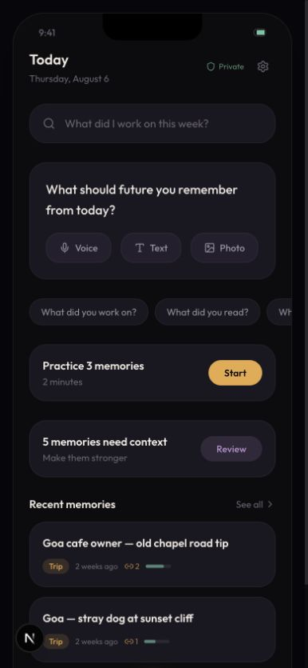
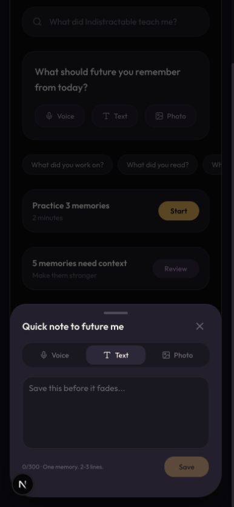
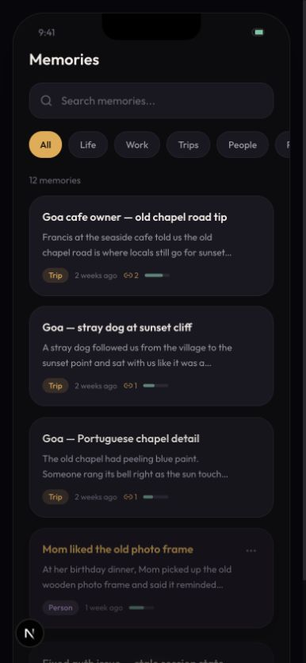
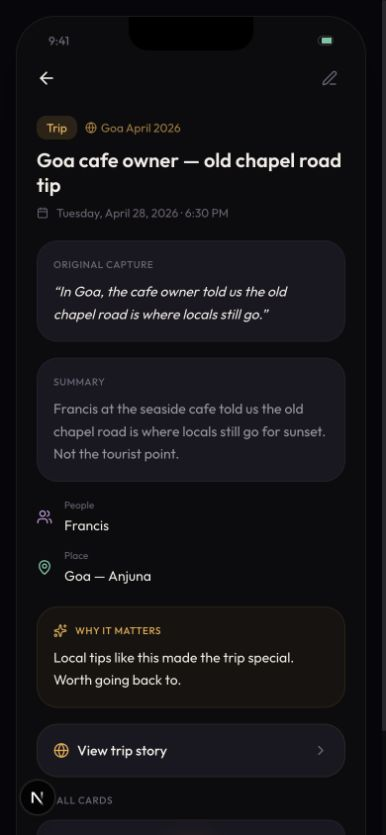
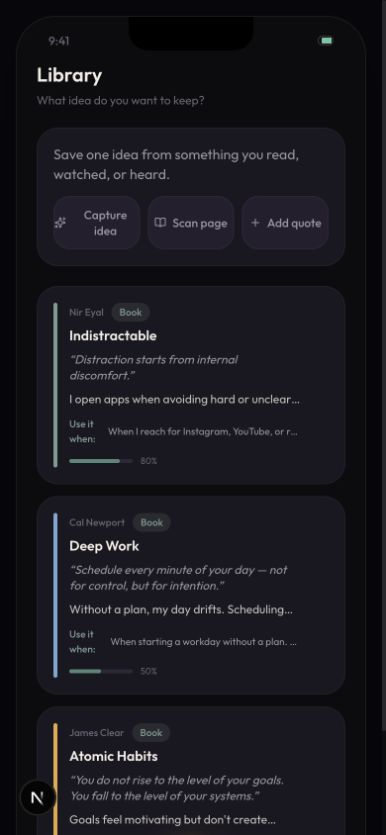
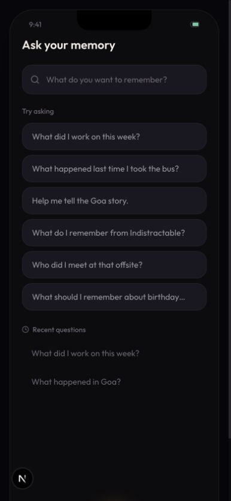
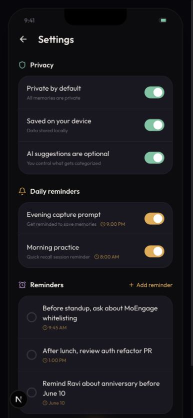

# MemoryOS mobile lightness audit

Date: 2026-08-06  
Viewport: 390 x 844 CSS pixels  
Scope: Today, capture, Memories, memory detail, Library, Ask, and Settings

## Verdict

The product idea is strong, but the current prototype presents every supporting feature as a primary feature. The result feels heavy because content is repeated inside many dark cards, the home screen tries to do six jobs, and five bottom items mix navigation with an action.

The light first release should be text-first and built around one loop:

1. Capture a short note.
2. Find or ask for it later.
3. Follow a small number of useful connections.

## Recommended first-release structure

| Current surface | Decision | Lean replacement |
| --- | --- | --- |
| Today | Keep, simplify | One text prompt, one recent list, at most one contextual nudge |
| Memories | Keep, rename to Notes if desired | All content types in one collection with search |
| Capture tab | Keep as an action, not a tab | Inline composer on Today and a compose button elsewhere |
| Library | Merge | Book and source notes become filters/types inside Notes |
| Ask | Keep | One semantic retrieval screen with answers and sources |
| Inbox | Merge | A small `Needs details` filter or post-save prompt |
| Recall practice | Defer | Contextual review later, not a home block |
| Reminders/tasks | Remove from v1 | Keep at most one optional daily capture reminder |
| Trip stories | Defer | A generated action on a trip note later |
| Graph | Add later as a Notes view | Start with backlinks and a local 1–2 hop map |

Recommended top-level destinations: **Today, Notes, Ask**. Capture is an action. Settings stays behind a small profile/settings control.

## Highest-impact changes

- Remove the fake status bar, notch, home indicator, fixed 932px phone frame, outer padding, and shadow. Use the actual device viewport and safe-area insets.
- Remove the Ask bar from Today, the prompt-chip carousel, one of the two practice/review cards, and the connection preview. Today should not be a dashboard.
- Merge Library into Memories. Book notes already behave like a memory type.
- Reduce a memory detail to title, date/type metadata, the note body, and backlinks. Put AI summary, why-it-matters, recall cards, and story output behind one `More` or `Improve note` action.
- Replace stacked cards with plain list rows and separators. Use one accent color and whitespace for hierarchy.
- Ship text capture first. Defer voice, photo, scan-page, waveform animation, and AI categorization confirmation until the text loop is trusted.
- Remove continuous glow, staggered entrance motion, flip-card code, and hover lift. Use short platform-native transitions and respect reduced-motion settings.
- Replace mock data and local React state with real create/edit/delete/export persistence before store work.

## Obsidian-style graph

The graph is not inherently too much, but a global force graph should not be a primary tab or a first-release requirement. It becomes useful only after a person has accumulated enough notes and meaningful edges.

Start with text backlinks on each note. Then add an on-demand local graph around the selected note, limited to one or two hops. Add a global graph later, lazy-loaded from Notes, with cached positions and filters. This preserves a light default experience while keeping the graph available for people who value it.

## Step findings

### 1. Today — poor on a real phone viewport

- The fixed phone shell is taller than the viewport, so the bottom navigation disappears until the outer page is scrolled.
- Today contains search, capture modes, six prompt chips, recall practice, inbox review, recent notes, and a connection card.
- The core capture prompt is clear, but it competes with too many secondary actions.

### 2. Capture — fair, but over-specified

- The text field and short guidance are good.
- Voice, Text, and Photo repeat the same choices already shown on Today.
- The sheet is visually dense and its close control has no accessible name in the rendered interface.

### 3. Memories — fair

- Search is useful and should remain.
- Eight filter chips create a second navigation system and overflow horizontally.
- Large cards show too much metadata; a simple row can show title, one-line excerpt, and date/type.

### 4. Memory detail — poor

- Original capture and summary repeat nearly the same information in separate cards.
- Metadata, why-it-matters, trip story, recall cards, connections, and three actions turn one note into a long dashboard.
- Keep the original text central and progressively disclose generated material.

### 5. Library — redundant

- This is a second collection with a special card format for book memories.
- Merge it into Notes as a `Book` or `Source` type. `Scan page` and `Add quote` can become later capture options.

### 6. Ask — healthy core, heavy empty state

- Asking a natural-language question and showing sources is a core differentiator worth keeping.
- Six large suggestion cards plus recent questions are too much. Show two suggestions or a single rotating example.
- Remove the duplicate Ask bar from Today so this screen owns semantic retrieval.

### 7. Settings — overloaded

- `Private by default` and `Saved on your device` should be clear product facts, not toggles that imply the guarantees can be disabled.
- Custom reminders turn the app into a task manager. Remove them from the first release.
- Keep privacy/AI controls, export/delete, theme, and at most one daily reminder.

## Accessibility risks visible in this run

- `--text-dim` has approximately 3.46:1 contrast on the page background and 3.12:1 on `surface-1`, below the 4.5:1 WCAG threshold for normal text. It is frequently used at 9–10px.
- Several icon-only buttons have no accessible names. The custom toggle buttons do not expose switch state in the captured DOM.
- Many controls are 32–38px high; primary mobile touch targets should be larger.
- Continuous pulse/glow and repeated entrance animations need a reduced-motion path.
- Screenshot evidence cannot confirm screen-reader order, keyboard behavior, dynamic type, or full WCAG compliance; those require device and assistive-technology testing.

## Code and bundle weight

- `framer-motion` is imported across nearly every route for basic fades, tap scaling, and decorative motion. Replace these with a few CSS transitions and remove the dependency.
- `tw-animate-css` plus the custom pulse, float, glow, shimmer, stagger, and flip-card animations duplicate the same job. Keep only a short modal transition and pressed states.
- Remove unused generated UI component files and unused imports. Files that are not imported do not add runtime bundle weight, but they add maintenance noise.
- Keep accessible primitives where they solve a real interaction such as a modal; use plain semantic HTML for ordinary buttons, text fields, lists, and rows.
- The current lint check reports 4 errors and 16 warnings. The errors include render-time `Math.random()` calls in Recall and the capture waveform, plus an explicit `any` in Ask. Fix or remove these before treating the prototype as a production base.

## Store-readiness sequence

1. Validate the three-destination, text-first product in the current prototype.
2. Implement real local persistence, edit/delete/export, offline behavior, and clear AI data handling.
3. Remove the simulated hardware shell and implement real iOS/Android safe areas, keyboard behavior, touch targets, and accessibility labels.
4. Package the client app with a native runtime, then add only the native features that serve the core loop: share-to-app, optional notification, secure local storage, and file export.
5. Test on small and large iPhones, Android edge-to-edge devices, large text, VoiceOver/TalkBack, offline mode, and interrupted saves.
6. Prepare privacy policy, store privacy/data-safety declarations, app metadata, production icons/screenshots, signing, and review notes.
