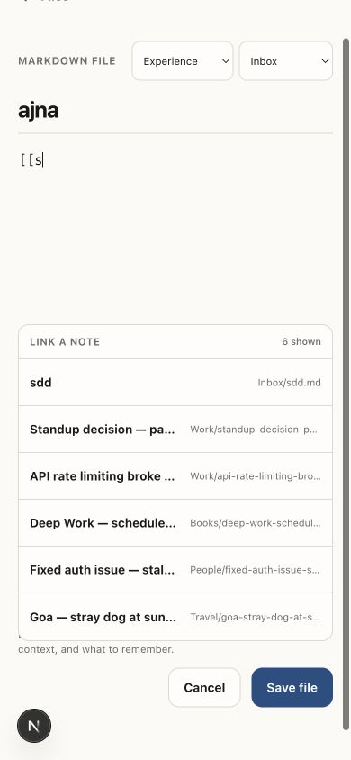

# Simplicity and Link Flow Audit

## Scope

Combined UX and accessibility audit of the mobile path: Today capture → Files → note → `[[wikilink]]` → linked note → Files. Viewports checked at 390 × 844 and 320 × 700.

## Overall verdict

The flow is now materially simpler and the reported navigation failures are fixed. Capture is a focused writing state instead of a small card. Wikilinks are discoverable while typing and stay within client navigation. Files is deterministic rather than browser-history dependent.

## Flow steps

### 1. Today — healthy

- Strength: one capture entry point, one recall, one recent item.
- Simplification: removed the always-visible Book learning and Experience grid.
- Accessibility: semantic regions, visible labels, 44px or larger primary targets.

### 2. Focused capture — healthy

- Strength: bottom navigation and unrelated recall content disappear while writing.
- Writing area: at least 48dvh / 400px before padding, with no character cap.
- Book learning and Experience are optional, accessible pressed-state choices; Inbox remains the default.
- The 320px check has no horizontal overflow.

### 3. Files — healthy

- Experience captures now appear under `Experiences` immediately and after reload.
- Folder groups also include folder paths found in saved notes, preventing unknown folders from hiding files.
- File rows no longer expose raw Markdown previews such as `[[target]]`; filename, path, and memory kind remain.

### 4. Note view — healthy

- Existing `[[sdd.md]]` resolves and opens the correct stored note.
- Client-side links avoid the earlier full-page reload and transient local-storage missing-note state.
- The hydration state now says `Opening note…` instead of incorrectly showing `File not found`.

### 5. Markdown editor and link picker — healthy

- Typing `[[` shows existing notes; typing `[[s` ranks `sdd.md` first.
- Selecting a result inserts `[[sdd.md]]` and closes the picker.
- Duplicate filenames use their full folder path to avoid opening the wrong note.
- The picker stays above editor actions and uses title plus file path for disambiguation.
- The body provides at least 62dvh of writing space; selects are now 44px tall and stack at narrow widths.

### 6. Return to Files — healthy

- Opening a note directly and choosing Files returns to `/memories`.
- Files → note A → linked note B → Files also returns to `/memories`.
- The action is now an explicit route rather than `history.back()`.

## Fixed findings

- P0: Experience notes were saved to a folder the Library did not render.
- P1: `[[` syntax had no in-editor suggestions.
- P1: Back to Files could land on `about:blank` or the previous note.
- P1: forced full-page wikilink navigation exposed a false File not found state.
- P2: Today capture was only 112px high and visually behaved like a web card.
- P2: editor property controls were below native touch-target guidance.

## Evidence limits

Screenshots support visual hierarchy, target sizing, density, and responsive reflow. Screen-reader announcements and real software-keyboard behavior still require VoiceOver/TalkBack testing in the native builds. Notification behavior was outside this audit.
